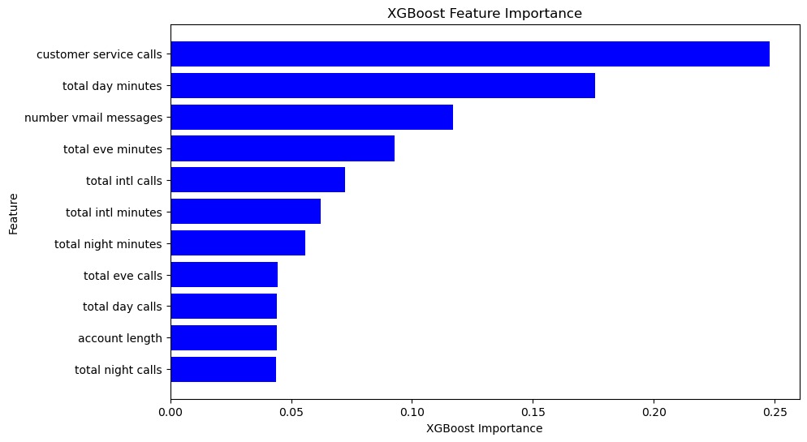

# SYRIATEL PREDICTIVE ANALYSIS OF CUSTOMER CHURN 

## INTRODUCTION
Syriatel, a telecommunications provider in Damascus, Syria, aims to predict customer churn by analyzing their data. Their main goal is to forecast if a customer will stop using their services. For telecom companies to grow revenue, attracting new customers while retaining existing ones is crucial. SyriaTel, offering mobile and data services, recognizes that maintaining long-term customer relationships is more effective than constantly seeking new ones while loosing existing customers. Hence, churn prediction is part of their key strategy.

### OVERVIEW
This project is centred on building a classifier on whether a customer will soon stop doing business with SyriaTel telecommunications company. The project is a binary classification project that aims to develop a model which accurately predicts customers who are most likely to churn and identify the features that are important for predicting customer churn. Thus, advise SyrialTel on ways to reduce customer churn if there is a predictable pattern.

### NOTEBOOK STRUCTURE
1. Business Understanding
2. Data Understanding
3. Data Cleaning
4. Exploratory Data Analysis
5. Data Preparation
6. Modelling
7. Evaluation
8. Conclusion

## 1. BUSINESS UNDERSTANDING
### *Stakeholders and Their Interests:* ###
The key stakeholder impacted by this project is the SyrialTel Telecom Business. Their interest is trying to predict whether there is a predictable pattern to customer churning and possible ways to reduce customer churning.

**Benefits for Syrialtel Telecommunication Company:**
- *Informed Decision-Making*: SyrialTel can use data-driven insights to make informed decisions that can reduce their losses from customer churn 
- *Tailored Advice*: Customized recommendations based on the unique features and strength of SyrialTel telecommunication Company.
- *Minimised Churn and thus losses*: SyrialTel can know the do's and don't to minimise the customer churn rate which in turn leads to money loss reduction because of customers who do not stick around. 

### OBJECTIVES ###
#### - Main Objective: ####
The main objective of this project is to build a predictive classifier that assists SyrialTel Telecommunication company in determining if there is a predictable pattern to customer churning. The classifier aims to predict the potential predictable patterns of customer churning.

#### - Specific Objectives ####

i). Identify Key Factors Influencing customer churning from the Telecommunication company.

ii). Evaluate the classifier performance for the classification problem using metrics such as accuracy, precision, recall, F1 score, and confusion matrix to assess the effectiveness of the model.

iii). Provide Actionable Recommendations to SyrialTel company to reduce money lost because of customers who do not stick around.

## 2.DATA UNDERSTANDING
-The data utilized for this project has been sourced from [Kaggle](https://www.kaggle.com/becksddf/churn-in-telecoms-dataset)

- The dataset contains 3333 entries and 21 columns, including information about the state, account length, area code, phone number, international plan, voice mail plan, number of voice mail messages, total day minutes, total day calls, total day charge, total evening minutes, total evening calls, total evening charge, total night minutes, total night calls, total night charge, total international minutes, total international calls, total international charge, customer service calls and churn.

#### **Summary of Features in the Dataset**
Each entry in the dataset represents a customer, and the attributes describe different aspects of their account and usage.

| Attribute                | Description                                                                                     |
|--------------------------|-------------------------------------------------------------------------------------------------|
| State                    | The state in which the customer resides.                                                       |
| Account Length           | The number of days the customer has had the account.                                             |
| Area Code                | The area code of the customer's phone number.                                                    |
| Phone Number             | The customer's phone number.                                                                    |
| International Plan       | A boolean indicating whether the customer has the international calling plan (True or False).   |
| Voice Mail Plan          | A boolean indicating whether the customer has the voicemail plan (True or False).               |
| Number Vmail Messages    | The number of voicemail messages the customer has sent.                                          |
| Total Day Minutes        | The total number of minutes the customer has been in calls during the day.                        |
| Total Day Calls          | The total number of calls the customer has made during the day.                                   |
| Total Day Charge         | The total amount of money charged by the telecom company for calls during the day.               |
| Total Eve Minutes        | The total number of minutes the customer has been in calls during the evening.                    |
| Total Eve Calls          | The total number of calls the customer has made during the evening.                               |
| Total Eve Charge         | The total amount of money charged by the telecom company for calls during the evening.           |
| Total Night Minutes      | The total number of minutes the customer has been in calls during the night.                      |
| Total Night Calls        | The total number of calls the customer has made during the night.                                  |
| Total Night Charge       | The total amount of money charged by the telecom company for calls during the night.             |
| Total Intl Minutes       | The total number of minutes the user has been in international calls.                             |
| Total Intl Calls         | The total number of international calls the customer has made.                                     |
| Total Intl Charge        | The total amount of money charged by the telecom company for international calls.                 |
| Customer Service Calls   | The number of calls the customer has made to customer service.                                     |
| Churn                    | A boolean indicating whether the customer terminated their contract (True or False).              |

### Data Types: ###
The data types include categorical, numerical and boolean data.
- Categorical Data: These are variables that represent categories or groups. Examples include 'state', 'phone number', 'international plan', and 'voice mail plan'.

- Numerical Data: These are variables that represent numerical values. This includes both integer and floating-point numbers, such as 'account length', 'area code', 'number vmail messages', 'total day minutes', 'total day charge', 'total eve minutes', 'total eve charge', 'total night minutes', 'total night charge', 'total intl minutes', 'total intl charge', 'total day calls', 'total eve calls', 'total night calls', 'total intl calls', and 'customer service calls'.

### Data Relevance to the Project: ###
The dataset contains a variety of factors crucial for understanding customer behavior and forecasting churn for SyrialTel Company. Essential attributes include customer subscriptions like international plans and voice mail plans, as well as call usage statistics such as total day minutes and total night minutes. The 'Churn' column, which acts as the target variable, distinguishes between customers who have terminated their service ('True') and those who haven't ('False'). This comprehensive dataset lays the groundwork for building a predictive model to accurately identify churn risks and implement focused retention strategies. This aligns with the project's goal of effectively reducing customer churn.

### Independent and Dependent variables ###
The dataset contains 21 features and of the 21:
- The dependent variable is **'Churn'**
- The independent variables are the remaining 20 features.

## 3.DATA CLEANING AND PRE-PROCESSING
The data was loaded and assessed after which some EDA was performed for better understanding. There were no missing values and no duplicates. All of the categorical features were changed for one hot encoding to be performed so that the data could be fit for modelling. The numerical features were also normalised to equalize the features and improve model performance. 

## 6.MODELING
The data was split into the training and test datasets with the training data used to fit the models and the test data used to evaluate them. The baseline model was created using Logistic Regression. KNN Model, Decision Trees, Random Forest and XGBoost were used. The modelling process was achieved by performing model tuning by hyperparameter tuning or feature importance selection to come up with the best model.
## 7.EVALUATION
### Best Model ###
From the different models used, which were:
1. Base Model - Logistic regression
2. K-Nearest Neighbours (KNN)
3. Decision trees
4. Random Forest classiffier 
5. XGBoost

The Best overal model proved to be the XGBoost model given that:
Based on accuracy, The best model was one from XGBoost with an test accuracy of 91.97% and training accuracy of 95.64%.
Based also on the Test ROC and AUC score, which is measure of the ability of model to distinguish positive and negative outcomes, XGBoost was the best with a score of 90%.

### **Top five features** ###

The top five features that were also crucial in determining the churn of customers were:
-  **Customer Service calls:** The number of customer services calls made by a customer
- **Total day minutes:** The total amount of time the customer has spent on daytime calls in minutes
- **Number vmail messages:** Represent the number of voicemail messages left by a customer.
- **Total eve minutes:** The total number of minutes the customer has been in calls during the evening.
- **Total intl calls:** The total number of international calls the customer has made.

### **Were the Objectives met** ###
**Main Objective**

Several predictive models were built, from which the top-performing one was selected as the best overall, The **XGBoost** was chosen as was considered fit in predicting the patterns of customers churning

**Specific Objectives**
1. Key factors influencing cusomer churning was identified as: Customer service calls, Total day minutes, Number of voice mail messages, total evening minutes and total international calls.
2. The classifiers were identified using metrics such as accuracy, precision, recall, F1 score, and confusion matrix after which XGBoost was selected as being the most effective.
3. Actionable recommendations given based on the analysis.

**YES, The Objectives were all met.**

## 8.CONCLUSION
### Recommendations ###
1. Improve on customer services: This may include services such as wait time and customer satisfaction.

2. Introduce customised and affordable call plans for boh day and night calls

3. Service Quality Improvement: Continuously monitor service quality metrics such as network reliability, call quality, and data speed, and invest in infrastructure upgrades to ensure optimal service delivery.

4. Transparent Pricing: Provide transparent pricing structures and billing processes to avoid billing disputes and customer dissatisfaction.

5. Proactive Customer Outreach: Regularly reach out to customers to gather feedback, address concerns, and offer assistance before they consider switching providers.

6. Security Measures: Implement stringent security measures to protect 
voicemail messages from unauthorized access and ensure customer privacy and data protection.

7. Provide a wide range of countries covered by international plan.

8. Constatntly and consistently conduct customer churn analysis 

### Next Steps ###
1. Deploying the model: Implement the churn prediction model into the operational environment to start making real-time predictions on customer churn, enabling proactive retention strategies.

2. Monitor and update the model: Continuously track the model's performance and accuracy over time, ensuring it remains effective in predicting churn, and regularly update it with new data to maintain relevance and accuracy.

3. Interpreting the model insights: Analyze the model's predictions and identify the key factors influencing customer churn, providing valuable insights for targeted retention efforts and strategic decision-making.

4. Collecting more diverse data: Expand the dataset by gathering a wider range of customer attributes, behaviors, and interactions to enhance the model's predictive capabilities and capture more nuanced patterns of churn behavior.

### Repository Guide ###
Notebook : [github](https://github.com/VincentKiplangat/Predicting-customer-churn-for-SyrialTel/blob/main/SyrialTel.ipynb)
The dataset used:[Kaggle](https://www.kaggle.com/becksddf/churn-in-telecoms-dataset)
Presentation: [Canva](https://www.canva.com/design/DAF-7cYSgXQ/DL-dSZ7tITgqiHc9t_ECQA/view)
